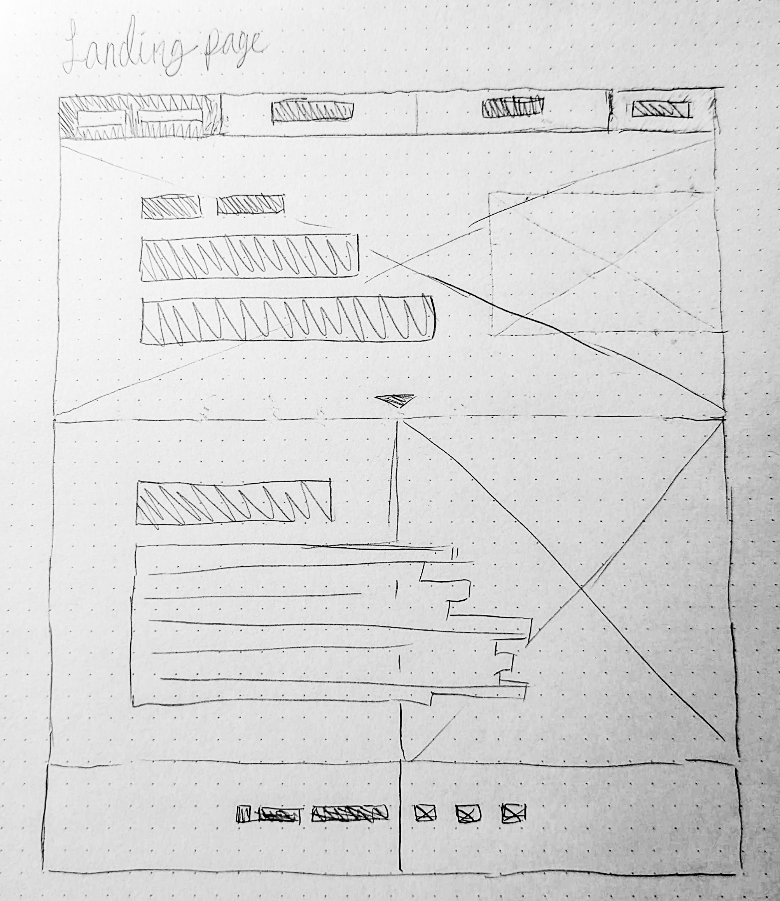
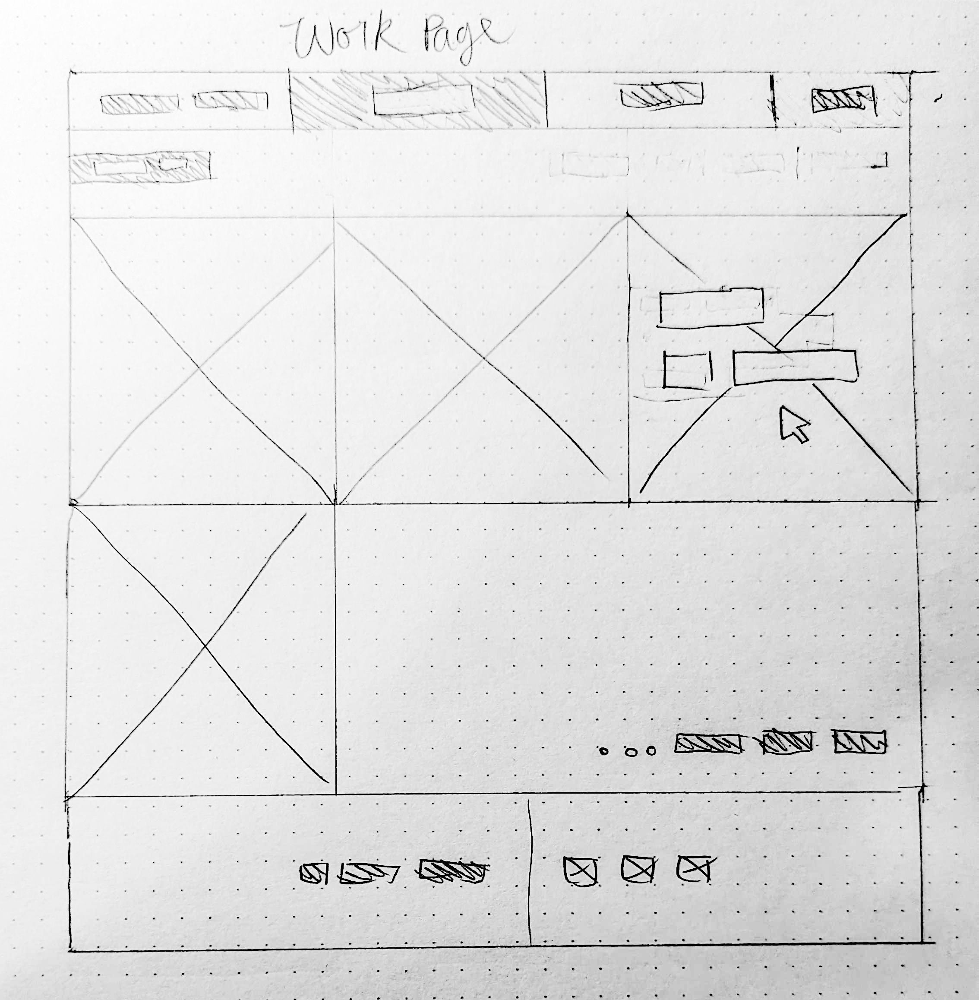
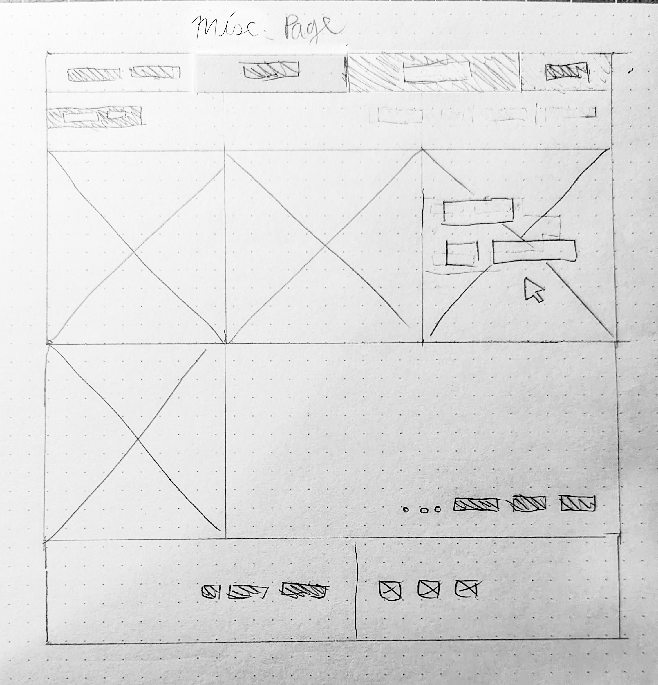
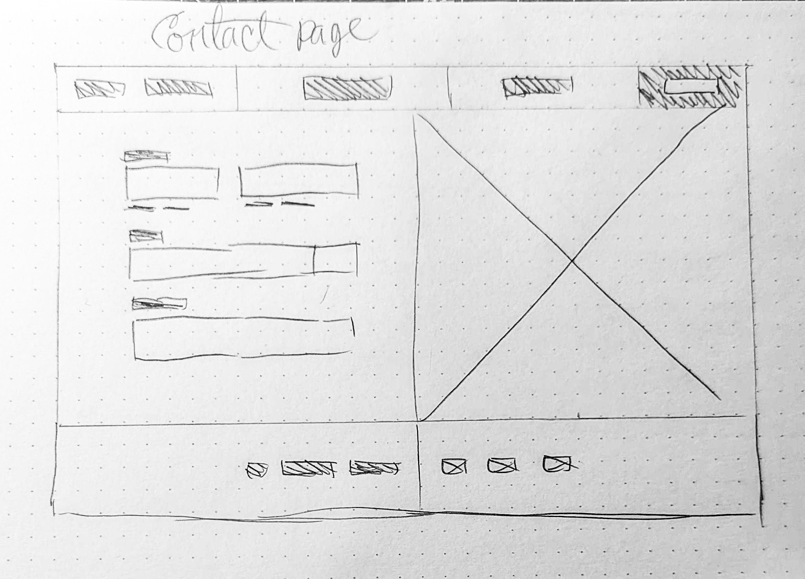

# Rylie Butner's INF6420 Project

 A portfolio site showcasing my work.

 ## Wireframes

 These wireframes show how I plan to structure my site.

 
  
 Header - includes my name and navigation menu

 Navigation menu - includes links to other pages and contact form

 Main Content - will have an about-me, including my current and past education, and what I do.

 Footer - will include copyright info and social links

 

 Header - includes my name and navigation menu

 Navigation menu - includes links to other pages and contact form

 Main Content - image tiles link to project pages, and a function to filter projects by topic: design or librarianship.

 Footer - will include copyright info and social links

 

 Header - includes my name and navigation menu

 Navigation menu - includes links to other pages and contact form

 Main Content - A place for my personal projects and other fun stuff.

 Footer - will include copyright info and social links

 

 Header - includes my name and navigation menu

 Navigation menu - includes links to other pages and contact form

 Main Content - a contact form

 Footer - will include copyright info and social links

